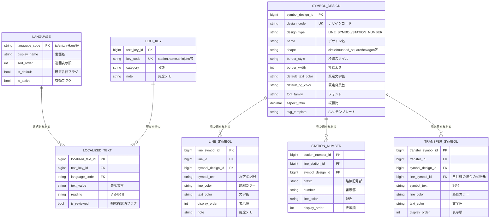

# 鉄道案内Webアプリ 要件定義書（v0.2）

## 1. システム概要

### 1.1 目的
列車の運行状態（走行中／接近中／停車中／発車中）に応じて、乗客向けの案内情報を自動で切り替えて表示するWebアプリケーション。

### 1.2 利用形態
本システムは **1つのブラウザ内の2種類のウィンドウ** で構成される。

| ウィンドウ | 役割 |
|---|---|
| **メインウィンドウ** | 設定・操作用。マスタ管理、画面デザイン定義、列車の選択、現在地・号車・列車状態の設定を行う。表示ウィンドウを起動する親となる |
| **表示ウィンドウ**（ポップアップ） | 実際の案内表示用。メインウィンドウから状態変更をプッシュ受信し、スライドショーを再生する。複数枚同時に開ける |

設置想定は **列車内に固定設置するモニタ、または列車内の乗客が自身の端末で使用する** もの。駅への固定設置は対象外。

### 1.3 スコープ

| 区分 | 内容 |
|---|---|
| 本システムの責務 | 外部DBのミラー保持、案内コンテンツ管理、画面デザイン／レイアウト／スライドショー定義、状態のプッシュ配信、案内画面のレンダリング |
| 外部システム（別DB） | 列車設定（ダイヤ・停車駅・編成）、状態設定（運行状態・位置・遅延）のマスタ元 |
| 対象外 | 発券・予約、駅設置サイネージ、運行管理そのもの |

---

## 2. 用語定義

| 用語 | 定義 |
|---|---|
| 列車（TRAIN） | ダイヤ上の1本の列車。列車番号で識別される静的な定義。直通運転により**複数路線にまたがる** |
| 運行（TRAIN_RUN） | ある日付における列車の運行インスタンス |
| 列車状態 | 走行中(RUNNING) / 接近中(APPROACHING) / 停車中(STOPPED) / 発車中(DEPARTING) の4区分 |
| 停車駅 / 通過駅 | `TRAIN_STOP.stop_type` で区別。`STOP`=停車、`PASS`=通過 |
| コンポーネント | 「次駅表示」「路線図」など案内の1部品 |
| テンプレート | 画面を領域分割したデザインパターン |
| レイアウト | テンプレートの各領域にコンポーネントを割り当てた1画面 |
| スライドショー | レイアウトを順序・秒数付きで並べた再生リスト |
| シンボルデザイン | ラインシンボル・駅ナンバリングの見た目（形状・枠線・配色）の定義 |

---

## 3. §8 への回答の反映結果（決定事項）

| No | 論点 | 決定 | 設計への反映 |
|---|---|---|---|
| 1 | 外部DBとの境界 | **ミラーする** | マスタ各テーブルに `source_system` / `source_updated_at` / `synced_at` を持つ。同期はバッチ＋差分取込 |
| 2 | 連携方式 | **プッシュ** | メインウィンドウ→表示ウィンドウは `BroadcastChannel` によるプッシュ。サーバ→メインウィンドウは WebSocket／SSE |
| 3 | 多言語 | **任意に追加可能** | `LANGUAGE` / `TEXT_KEY` / `LOCALIZED_TEXT` の3テーブルに集約。名称カラムは全て `*_text_key_id` 参照に変更 |
| 4 | 路線図 | **SVG＋データ駆動、背景画像も可** | `ROUTE_MAP`（背景画像・viewBox）＋ `ROUTE_MAP_NODE`（駅座標）＋ `ROUTE_MAP_EDGE`（線形パス）に分解 |
| 5 | 表示条件 | **列車状態のみ** | `DISPLAY_CONDITION` を廃止。`SLIDESHOW_ITEM_STATUS` で対象状態を指定。それ以外の分岐は各デザインHTML内で判定 |
| 6 | 号車の特定 | **ウィンドウに固定紐付け** | 端末＝表示ウィンドウ。メインウィンドウで現在地と号車を設定。駅設置端末の概念を削除 |
| 7 | 通過駅 | **区別する** | `TRAIN_STOP.stop_type` を追加。通過駅も同一テーブルに順序付きで保持し、路線図描画に使用 |
| 8 | 履歴保持 | **不要** | `TRAIN_STATUS_LOG` を廃止し、1運行1レコードの `TRAIN_RUN_STATE`（上書き）に変更 |
| 9 | 直通運転 | **対応する** | 列車と路線を1対多にするため `TRAIN_LINE_SEGMENT` を新設。`TRAIN.line_id` は削除 |

### 追加の修正点

| 項目 | 対応 |
|---|---|
| TRANSFER_INFO に路線同等の情報 | 乗換先が自社DBに無い他社線でも表現できるよう、`TRANSFER_INFO` に表示名・事業者名を直接持たせ、`to_line_id` は任意参照とした |
| 1路線で複数シンボル | `LINE_SYMBOL` を新設（1路線に複数行）。乗換側は `TRANSFER_SYMBOL` で複数持てる |
| シンボル／駅番号のデザイン定義 | `SYMBOL_DESIGN` を新設。`design_type` で「ラインシンボル用」「駅ナンバリング用」を区別し、各所から参照 |
| 駅ナンバリング | `LINE_STATION.station_number` を廃止し、`STATION_NUMBER` テーブルへ分離（1駅に複数番号を保持可能。直通・複数路線に対応） |

---

## 4. 機能要件

### 4.1 案内表示機能（表示ウィンドウ）

| ID | 機能 | 内容 |
|---|---|---|
| FR-01 | 現在／次駅表示 | 停車中は現在駅、走行中・接近中は次の**停車**駅を表示。通過駅は明示表示しない |
| FR-02 | 路線情報表示 | 路線名・ラインシンボル・路線カラーを表示。直通時は在線中の路線に追従する |
| FR-03 | 列車種別表示 | 種別名と種別カラーを表示。区間により種別が変わる場合は在線区間の種別を表示 |
| FR-04 | 行先表示 | 終着駅と経由を表示 |
| FR-05 | 列車状態表示 | 4状態を表示し、状態変化に応じてスライドを自動切替 |
| FR-06 | 路線図表示 | SVGで動的描画。停車駅・通過駅・現在位置・進行方向を表現。背景画像の重ね合わせに対応 |
| FR-07 | 所要時間表示 | 各停車駅までの見込み所要時間を、遅延分を加味して表示 |
| FR-08 | 乗換案内表示 | 乗換可能路線をシンボル付きで表示。徒歩時間、便利な号車を併記 |
| FR-09 | 注意事項表示 | お知らせを表示。重要度により割込表示 |
| FR-10 | 遅延状況表示 | 遅延分数と遅延理由を表示 |
| FR-11 | ホーム案内表示 | 到着ホームの出口・階段・EV・ESの位置を号車位置と対応付けて表示 |
| FR-12 | 号車表示 | ウィンドウに設定された号車と編成内の位置、車両設備を表示 |
| FR-13 | ドア開閉方向表示 | 次の停車駅で開くドアの方向（左／右／両側）を表示 |
| FR-14 | 多言語切替 | 設定された言語で表示。複数言語の巡回表示に対応 |

### 4.2 表示制御機能

| ID | 機能 | 内容 |
|---|---|---|
| FR-20 | 状態プッシュ受信 | メインウィンドウからの状態変更を受信し、即時に反映 |
| FR-21 | スライドショー再生 | 設定順・設定秒数でレイアウトを巡回表示 |
| FR-22 | 状態によるフィルタ | 現在の列車状態に対応するスライドのみを再生対象とする |
| FR-23 | 割込表示 | 重要度の高いお知らせは再生を中断して優先表示 |
| FR-24 | ウィンドウ内分岐 | 状態以外の条件（遅延有無、乗換の有無、時間帯など）は各デザインHTML内のロジックで判定し、表示内容を出し分ける |
| FR-25 | 接続断時の動作 | メインウィンドウとの接続が切れた場合、直前の状態を保持して再生を継続。一定時間経過後は縮退表示に切替 |

### 4.3 操作機能（メインウィンドウ）

| ID | 機能 | 内容 |
|---|---|---|
| FR-30 | 列車選択 | 運行日と列車番号から対象の運行を選択する |
| FR-31 | 現在地設定 | 在線位置（現在駅／次駅／駅間の進捗）を設定する |
| FR-32 | 号車設定 | 表示ウィンドウごとに号車を割り当てる |
| FR-33 | 状態設定 | 走行中／接近中／停車中／発車中を切り替える。手動操作と自動進行の両方に対応 |
| FR-34 | 遅延設定 | 遅延分数と理由を設定する |
| FR-35 | 表示ウィンドウ起動 | スライドショー・号車・言語を指定して表示ウィンドウをポップアップで開く |

### 4.4 設定・管理機能

| ID | 機能 | 内容 |
|---|---|---|
| FR-40 | テンプレート管理 | 領域分割パターンの登録・編集 |
| FR-41 | レイアウト管理 | 領域へのコンポーネント割当 |
| FR-42 | スライドショー管理 | 表示順・秒数・対象の列車状態を設定 |
| FR-43 | シンボルデザイン管理 | ラインシンボル・駅ナンバリングの形状／配色パターンを定義 |
| FR-44 | 多言語テキスト管理 | 言語の追加、各テキストキーの訳文編集、未翻訳の抽出 |
| FR-45 | 路線図エディタ | 駅ノードの座標配置、線形パスの編集、背景画像の設定 |
| FR-46 | マスタ管理 | 路線・駅・ホーム設備・乗換情報・お知らせの編集 |
| FR-47 | 外部DB同期管理 | 同期の実行・状況確認・差分確認 |
| FR-48 | プレビュー | 任意の状態を指定して表示を確認 |

---

## 5. 非機能要件

| 分類 | 要件 |
|---|---|
| 応答性 | 状態変化から表示ウィンドウへの反映まで1秒以内（同一ブラウザ内通信のため） |
| ウィンドウ間通信 | `BroadcastChannel` を主、`window.postMessage` をフォールバックとする。表示ウィンドウは起動時に現在状態を要求し、以降は差分を受信 |
| 可用性 | 表示ウィンドウはマスタと画面定義をIndexedDBにキャッシュし、通信断でも継続表示する |
| 表示環境 | 横長（16:9・32:9）、縦型に対応。レイアウトはテンプレート単位で切替 |
| 多言語 | 言語の追加はマスタ登録のみで可能とし、コード変更を伴わない |
| アクセシビリティ | 色のみに依存しない表現、コントラスト比4.5:1以上 |
| セキュリティ | メインウィンドウは認証必須（管理者／運用者／閲覧者）。表示ウィンドウはメインウィンドウが発行したトークンで認可 |
| 同期 | 外部DBからの取込は差分同期。同期失敗時も既存ミラーで運転継続可能とする |

---

## 6. データ設計方針

- **多言語は完全に外出しする**：名称系のカラムは `*_text_key_id` として `TEXT_KEY` を参照し、実文言は `LOCALIZED_TEXT` に言語ごとの行として持つ。言語追加は `LANGUAGE` への1行追加で完結する。
- **シンボルの見た目と値を分離する**：形状・枠線・配色は `SYMBOL_DESIGN`、実際の文字と色は `LINE_SYMBOL` / `STATION_NUMBER` に持つ。デザイン変更が全路線に一括反映される。
- **直通運転は区間で表す**：`TRAIN_LINE_SEGMENT` により、1列車が路線A→路線Bと跨る運行を、区間ごとの路線・種別・方向として表現する。
- **停車と通過を同一テーブルで順序管理する**：`TRAIN_STOP` に通過駅も含めて `sequence` を振り、`stop_type` で区別する。「次の停車駅」は `stop_type='STOP'` の最小 sequence、路線図は全レコードを使って描画する。
- **状態は履歴を持たない**：`TRAIN_RUN_STATE` は運行に1レコードで上書き更新する。
- **表示条件は列車状態のみ**：条件マスタを廃し、`SLIDESHOW_ITEM_STATUS` に対象状態を列挙する。細かな出し分けはデザインHTML側の責務とする。

---

## 7. ER図

### 7.1 多言語・シンボルデザイン（共通基盤）

> **注**：以降の図で `*_text_key_id` と付くカラムは、すべて `TEXT_KEY.text_key_id` を参照する外部キー。可読性のため関連線は省略している。

### 7.2 全体ER図

```mermaid
erDiagram
    %% ========== 路線・駅マスタ ==========
    OPERATOR ||--o{ LINE : "運営する"
    LINE ||--o{ LINE_SYMBOL : "シンボルを持つ"
    LINE ||--o{ LINE_STATION : "駅順を持つ"
    STATION ||--o{ LINE_STATION : "所属する"
    LINE_STATION ||--o{ STATION_NUMBER : "駅番号を持つ"
    LINE_STATION ||--o{ TRANSFER_INFO : "乗換元となる"
    LINE |o--o{ TRANSFER_INFO : "乗換先となる"
    TRANSFER_INFO ||--o{ TRANSFER_SYMBOL : "表示シンボルを持つ"
    LINE_SYMBOL |o--o{ TRANSFER_SYMBOL : "流用される"
    STATION ||--o{ PLATFORM : "ホームを持つ"
    PLATFORM ||--o{ PLATFORM_FACILITY : "設備を持つ"

    %% ========== 路線図 ==========
    LINE ||--o{ ROUTE_MAP : "路線図を持つ"
    ROUTE_MAP ||--|{ ROUTE_MAP_NODE : "駅ノードを持つ"
    ROUTE_MAP ||--o{ ROUTE_MAP_EDGE : "線形を持つ"
    LINE_STATION ||--o{ ROUTE_MAP_NODE : "描画対象となる"

    %% ========== 列車マスタ（直通対応） ==========
    OPERATOR ||--o{ TRAIN_TYPE : "定義する"
    OPERATOR ||--o{ TRAIN : "運行する"
    TRAIN_TYPE ||--o{ TRAIN : "基本種別を与える"
    STATION ||--o{ TRAIN : "行先となる"
    TRAIN ||--|{ TRAIN_LINE_SEGMENT : "運行区間を持つ"
    LINE ||--o{ TRAIN_LINE_SEGMENT : "経由される"
    TRAIN_TYPE ||--o{ TRAIN_LINE_SEGMENT : "区間種別を与える"
    TRAIN ||--|{ TRAIN_STOP : "経由駅を持つ"
    LINE ||--o{ TRAIN_STOP : "所属路線となる"
    STATION ||--o{ TRAIN_STOP : "停車通過される"
    PLATFORM ||--o{ TRAIN_STOP : "発着番線となる"

    %% ========== 編成・号車 ==========
    FORMATION ||--|{ CAR : "号車で構成される"
    CAR ||--o{ CAR_FACILITY : "設備を持つ"

    %% ========== 運行状態（履歴なし） ==========
    TRAIN ||--o{ TRAIN_RUN : "運行実体となる"
    FORMATION ||--o{ TRAIN_RUN : "充当される"
    TRAIN_RUN ||--|| TRAIN_RUN_STATE : "現在状態を持つ"
    STATION ||--o{ TRAIN_RUN_STATE : "現在駅次駅となる"
    LINE ||--o{ TRAIN_RUN_STATE : "在線路線となる"

    %% ========== お知らせ ==========
    NOTICE ||--|{ NOTICE_TARGET : "適用対象を持つ"
    LINE ||--o{ NOTICE_TARGET : "対象となる"
    STATION ||--o{ NOTICE_TARGET : "対象となる"
    TRAIN ||--o{ NOTICE_TARGET : "対象となる"

    %% ========== 画面定義 ==========
    SCREEN_TEMPLATE ||--|{ TEMPLATE_AREA : "領域を持つ"
    SCREEN_TEMPLATE ||--o{ SCREEN_LAYOUT : "適用される"
    SCREEN_LAYOUT ||--|{ LAYOUT_AREA_ASSIGN : "割当を持つ"
    TEMPLATE_AREA ||--o{ LAYOUT_AREA_ASSIGN : "割当先となる"
    CONTENT_COMPONENT ||--o{ LAYOUT_AREA_ASSIGN : "配置される"
    CONTENT_COMPONENT ||--o{ COMPONENT_OPTION : "設定項目を持つ"

    %% ========== スライドショー ==========
    SLIDESHOW ||--|{ SLIDESHOW_ITEM : "スライドを持つ"
    SCREEN_LAYOUT ||--o{ SLIDESHOW_ITEM : "表示される"
    SLIDESHOW_ITEM ||--|{ SLIDESHOW_ITEM_STATUS : "対象状態を持つ"

    %% ========== ウィンドウ・セッション ==========
    APP_USER ||--o{ CONTROL_SESSION : "操作する"
    TRAIN_RUN ||--o{ CONTROL_SESSION : "操作対象となる"
    CONTROL_SESSION ||--o{ DISPLAY_WINDOW : "配下に持つ"
    SLIDESHOW ||--o{ DISPLAY_WINDOW : "再生される"
    CAR ||--o{ DISPLAY_WINDOW : "号車を割り当てる"
    LANGUAGE ||--o{ DISPLAY_WINDOW : "表示言語となる"

    OPERATOR {
        bigint operator_id PK
        string operator_code UK "事業者コード"
        bigint name_text_key_id FK "事業者名"
        string source_system "同期元"
        datetime synced_at "同期日時"
    }

    LINE {
        bigint line_id PK
        bigint operator_id FK
        string line_code UK "路線コード"
        bigint name_text_key_id FK "路線名"
        string primary_color "代表カラー"
        int display_order "表示順"
        string source_system "同期元"
        datetime synced_at "同期日時"
    }

    STATION {
        bigint station_id PK
        string station_code UK "駅コード"
        bigint name_text_key_id FK "駅名"
        decimal latitude "緯度"
        decimal longitude "経度"
        string source_system "同期元"
        datetime synced_at "同期日時"
    }

    LINE_STATION {
        bigint line_station_id PK
        bigint line_id FK
        bigint station_id FK
        int station_order "路線内の駅順"
        decimal distance_km "起点からのキロ程"
        int standard_minutes_from_prev "前駅からの標準所要分"
    }

    TRANSFER_INFO {
        bigint transfer_id PK
        bigint line_station_id FK "乗換元の路線内駅"
        bigint to_line_id FK "自社線の場合のみ設定"
        bigint display_name_text_key_id FK "乗換先路線名"
        bigint operator_name_text_key_id FK "乗換先事業者名"
        bigint note_text_key_id FK "備考"
        string primary_color "代表カラー"
        int walk_minutes "徒歩所要分"
        int recommended_car_no "便利な号車"
        int display_order "表示順"
    }

    PLATFORM {
        bigint platform_id PK
        bigint station_id FK
        string platform_no "番線"
        bigint direction_text_key_id FK "方面表記"
        bool has_platform_door "ホームドア有無"
        int car_positions "停車位置数"
    }

    PLATFORM_FACILITY {
        bigint facility_id PK
        bigint platform_id FK
        string facility_type "出口/階段/EV/ES/トイレ/改札"
        bigint label_text_key_id FK "名称"
        int near_car_no "最寄り号車"
        int near_door_no "最寄りドア番号"
        decimal pos_x "ホーム図上X"
        decimal pos_y "ホーム図上Y"
        bool barrier_free "バリアフリー対応"
    }

    ROUTE_MAP {
        bigint route_map_id PK
        bigint line_id FK
        string direction "上り/下り"
        int viewbox_width "SVG幅"
        int viewbox_height "SVG高さ"
        string background_image_url "背景画像"
        decimal background_opacity "背景不透明度"
        json style_json "描画スタイル定義"
        date valid_from "適用開始日"
        date valid_to "適用終了日"
    }

    ROUTE_MAP_NODE {
        bigint node_id PK
        bigint route_map_id FK
        bigint line_station_id FK
        decimal pos_x "X座標"
        decimal pos_y "Y座標"
        string label_position "ラベル位置"
        decimal label_angle "ラベル角度"
        string node_shape "ノード形状"
        bool show_station_number "駅番号表示有無"
        bool show_transfer "乗換シンボル表示有無"
    }

    ROUTE_MAP_EDGE {
        bigint edge_id PK
        bigint route_map_id FK
        bigint from_node_id FK
        bigint to_node_id FK
        string path_d "SVGパス定義"
        string stroke_color "線色"
        int stroke_width "線幅"
        string stroke_style "実線/破線"
    }

    TRAIN_TYPE {
        bigint train_type_id PK
        bigint operator_id FK
        string type_code "種別コード"
        bigint name_text_key_id FK "種別名"
        string type_color "種別カラー"
        string text_color "文字色"
        int priority "優先度"
    }

    TRAIN {
        bigint train_id PK
        bigint operator_id FK
        bigint train_type_id FK "基本種別"
        bigint destination_station_id FK "行先"
        string train_number UK "列車番号"
        bigint via_text_key_id FK "経由表記"
        string operation_days "運転日パターン"
        string source_system "同期元"
        datetime synced_at "同期日時"
    }

    TRAIN_LINE_SEGMENT {
        bigint segment_id PK
        bigint train_id FK
        bigint line_id FK
        bigint train_type_id FK "区間ごとの種別"
        int segment_order "区間順"
        bigint from_station_id "区間開始駅"
        bigint to_station_id "区間終了駅"
        string direction "上り/下り"
        bool is_through_service "直通区間フラグ"
    }

    TRAIN_STOP {
        bigint train_stop_id PK
        bigint train_id FK
        bigint line_id FK "在線路線"
        bigint station_id FK
        bigint platform_id FK
        int sequence "通過順（通過駅含む）"
        string stop_type "STOP=停車 PASS=通過"
        time arrival_time "着時刻"
        time departure_time "発時刻"
        string door_side "開扉方向 左/右/両"
        string stop_position "停車位置"
    }

    FORMATION {
        bigint formation_id PK
        string formation_code UK "編成番号"
        int car_count "両数"
        bigint series_text_key_id FK "形式名"
        string source_system "同期元"
    }

    CAR {
        bigint car_id PK
        bigint formation_id FK
        int car_no "号車番号"
        int sequence "編成内の位置"
        int door_count "片側ドア数"
        bool has_priority_seat "優先席有無"
        bool is_women_only "女性専用車"
        bool is_weak_ac "弱冷房車"
    }

    CAR_FACILITY {
        bigint car_facility_id PK
        bigint car_id FK
        string facility_type "トイレ/車椅子スペース/WiFi等"
        bigint label_text_key_id FK "表示名"
    }

    TRAIN_RUN {
        bigint train_run_id PK
        bigint train_id FK
        bigint formation_id FK
        date service_date "運行日"
        string run_status "通常/運休/臨時"
        datetime started_at "運行開始時刻"
    }

    TRAIN_RUN_STATE {
        bigint train_run_id PK
        bigint current_line_id FK "在線路線"
        bigint current_station_id FK "現在駅または直前駅"
        bigint next_stop_station_id FK "次の停車駅"
        bigint next_pass_station_id FK "次の通過駅"
        string train_status "RUNNING/APPROACHING/STOPPED/DEPARTING"
        decimal progress_ratio "駅間の進捗率"
        int eta_seconds "次停車駅までの見込み秒数"
        int delay_minutes "遅延分"
        bigint delay_reason_text_key_id FK "遅延理由"
        datetime updated_at "更新時刻"
    }

    NOTICE {
        bigint notice_id PK
        string category "運行情報/マナー/臨時/工事"
        int severity "重要度"
        bigint title_text_key_id FK "件名"
        bigint body_text_key_id FK "本文"
        string media_url "画像動画URL"
        datetime display_from "掲出開始"
        datetime display_to "掲出終了"
        bool is_interrupt "割込表示フラグ"
    }

    NOTICE_TARGET {
        bigint notice_target_id PK
        bigint notice_id FK
        string target_type "LINE/STATION/TRAIN/ALL"
        bigint line_id FK
        bigint station_id FK
        bigint train_id FK
    }

    SCREEN_TEMPLATE {
        bigint template_id PK
        string template_code UK "テンプレートコード"
        string name "テンプレート名"
        string orientation "横/縦"
        int base_width "基準幅"
        int base_height "基準高さ"
        string thumbnail_url "サムネイル"
    }

    TEMPLATE_AREA {
        bigint area_id PK
        bigint template_id FK
        string area_code "領域コード"
        decimal pos_x "X座標（％）"
        decimal pos_y "Y座標（％）"
        decimal width "幅（％）"
        decimal height "高さ（％）"
        int z_index "重なり順"
    }

    CONTENT_COMPONENT {
        bigint component_id PK
        string component_code UK "next_station等"
        string name "コンポーネント名"
        string category "案内種別"
        string html_path "デザインHTMLのパス"
        string min_size "最小推奨サイズ"
    }

    COMPONENT_OPTION {
        bigint option_id PK
        bigint component_id FK
        string option_key "設定キー"
        string value_type "値型"
        string default_value "既定値"
        string description "説明"
    }

    SCREEN_LAYOUT {
        bigint layout_id PK
        bigint template_id FK
        string name "レイアウト名"
        string theme "配色テーマ"
        bool is_active "有効フラグ"
    }

    LAYOUT_AREA_ASSIGN {
        bigint assign_id PK
        bigint layout_id FK
        bigint area_id FK
        bigint component_id FK
        json option_values "コンポーネント設定値"
    }

    SLIDESHOW {
        bigint slideshow_id PK
        string name "スライドショー名"
        bool loop_enabled "ループ有無"
        int default_duration_sec "既定表示秒数"
        bool is_active "有効フラグ"
    }

    SLIDESHOW_ITEM {
        bigint slideshow_item_id PK
        bigint slideshow_id FK
        bigint layout_id FK
        int display_order "表示順"
        int duration_sec "表示秒数"
        string transition "切替効果"
        bool skip_if_no_data "データ無し時スキップ"
    }

    SLIDESHOW_ITEM_STATUS {
        bigint item_status_id PK
        bigint slideshow_item_id FK
        string train_status "対象の列車状態"
    }

    APP_USER {
        bigint user_id PK
        string login_id UK "ログインID"
        string display_name "表示名"
        string role "管理者/運用者/閲覧者"
        bool is_active "有効フラグ"
    }

    CONTROL_SESSION {
        bigint session_id PK
        bigint user_id FK
        bigint train_run_id FK "操作対象の運行"
        string channel_name "BroadcastChannel名"
        string session_token "ウィンドウ認可トークン"
        bool auto_advance "自動進行モード"
        datetime started_at "開始時刻"
        datetime ended_at "終了時刻"
    }

    DISPLAY_WINDOW {
        bigint display_window_id PK
        bigint session_id FK
        bigint slideshow_id FK
        bigint car_id FK "割当号車"
        string language_code FK "表示言語"
        string window_name "ウィンドウ名"
        int window_width "ウィンドウ幅"
        int window_height "ウィンドウ高さ"
        string orientation "画面向き"
        bool rotate_language "言語巡回表示"
        datetime opened_at "起動時刻"
        datetime last_ping_at "最終応答時刻"
    }
```

---

## 8. 主要な処理フロー

### 8.1 起動から表示まで
1. 利用者がメインウィンドウにログインし、運行日と列車を選択する（`CONTROL_SESSION` を生成）。
2. 現在地（在線路線・現在駅／次駅・進捗率）と列車状態を設定する。
3. スライドショー・号車・言語を指定して表示ウィンドウを起動する（`DISPLAY_WINDOW` を生成）。
4. 表示ウィンドウは起動時に、マスタ・画面定義・現在状態を一括取得してキャッシュする。
5. `SLIDESHOW_ITEM` を表示順に評価し、`SLIDESHOW_ITEM_STATUS` に現在の列車状態を含むものだけを再生する。
6. 各スライドは `SCREEN_LAYOUT` → `LAYOUT_AREA_ASSIGN` を辿り、領域ごとにコンポーネントのHTMLを描画する。

### 8.2 状態変更時
1. メインウィンドウで状態を変更すると、サーバの `TRAIN_RUN_STATE` を更新する。
2. 同時に `BroadcastChannel` へ状態差分をブロードキャストする。
3. 表示ウィンドウは受信して再生キューを再評価し、対象外になったスライドを飛ばして即時に切り替える。
4. 各コンポーネントは受け取った状態をもとに、HTML内のロジックで表示内容を分岐させる（遅延の有無、乗換の有無など）。

---

## 9. 次に決めたい事項

| No | 論点 | 補足 |
|---|---|---|
| 1 | 自動進行の要否 | メインウィンドウで状態を手動切替するだけか、時刻表に沿って自動で進行させるモードも作るか |
| 2 | コンポーネントHTMLの提供形態 | iframe分離か、同一DOM内への埋め込みか。前者は独立性が高く、後者はレイアウト追従が容易 |
| 3 | コンポーネントへの状態受け渡し | HTML内で判定する以上、どの範囲のデータを渡すかの定義が必要（案：運行状態＋前後5駅＋乗換＋お知らせを1つのJSONで渡す） |
| 4 | 複数ウィンドウの号車 | 1セッションで複数号車ぶんのウィンドウを同時に開く運用を想定してよいか |
| 5 | 路線図のスコープ | 直通運転時、在線路線の路線図のみ表示か、直通先を繋いだ通し路線図を生成するか |
| 6 | 言語巡回の単位 | ウィンドウ全体で切り替えるか、コンポーネント単位で別言語を同時表示できるようにするか |
