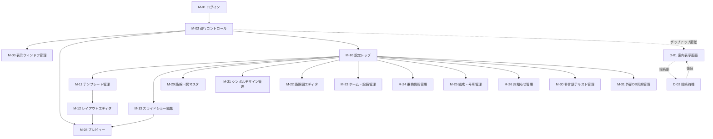
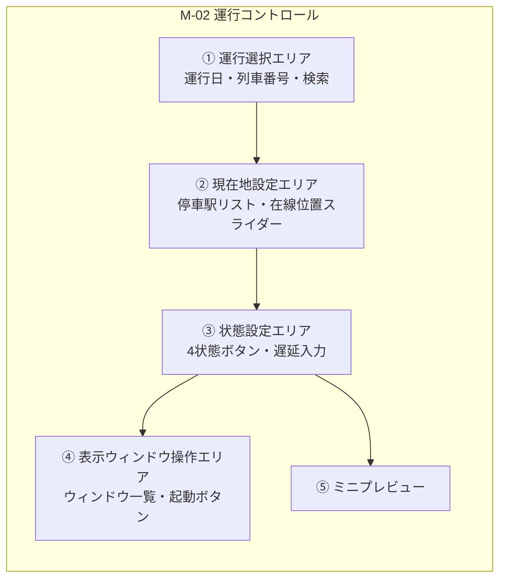

# 鉄道案内Webアプリ 画面定義書（v0.1）

## 1. 画面構成の全体像

本システムは2種類のブラウザウィンドウで構成される。

| 区分 | ウィンドウ | 説明 |
|---|---|---|
| **M系** | メインウィンドウ | 設定・操作用。単一ウィンドウ。SPAとして画面を切り替える |
| **D系** | 表示ウィンドウ | 案内表示用のポップアップ。複数枚を同時に開ける。ブラウザのUIを隠した全画面表示を想定 |

---

## 2. 画面一覧

### 2.1 メインウィンドウ（M系）

| 画面ID | 画面名 | 概要 | 権限 |
|---|---|---|---|
| M-01 | ログイン | 認証を行う | 全員 |
| M-02 | 運行コントロール | 列車選択、現在地・号車・状態設定、表示ウィンドウ起動。**本システムの中心画面** | 運用者以上 |
| M-03 | 表示ウィンドウ管理 | 開いているウィンドウの一覧・状態確認・一括操作 | 運用者以上 |
| M-04 | プレビュー | 任意の状態を指定してレイアウトを確認する | 閲覧者以上 |
| M-10 | 設定トップ | 各設定画面への入口 | 運用者以上 |
| M-11 | テンプレート管理 | 領域分割パターンの一覧・編集 | 管理者 |
| M-12 | レイアウトエディタ | 領域へのコンポーネント割当 | 管理者 |
| M-13 | スライドショー編集 | 表示順・秒数・対象状態の設定 | 管理者 |
| M-20 | 路線・駅マスタ | 路線、駅、駅順の編集 | 管理者 |
| M-21 | シンボルデザイン管理 | ラインシンボル／駅ナンバリングのデザイン定義 | 管理者 |
| M-22 | 路線図エディタ | 駅ノード配置、線形パス、背景画像の設定 | 管理者 |
| M-23 | ホーム・設備管理 | 番線、出口・EV・ES等の位置設定 | 管理者 |
| M-24 | 乗換情報管理 | 乗換先路線とシンボルの設定 | 管理者 |
| M-25 | 編成・号車管理 | 編成、号車、車両設備の設定 | 管理者 |
| M-26 | お知らせ管理 | 注意事項・運行情報の登録 | 運用者以上 |
| M-30 | 多言語テキスト管理 | 言語追加、訳文編集、未翻訳抽出 | 管理者 |
| M-31 | 外部DB同期管理 | 同期実行、同期結果、差分確認 | 管理者 |

### 2.2 表示ウィンドウ（D系）

| 画面ID | 画面名 | 概要 |
|---|---|---|
| D-01 | 案内表示画面 | スライドショーを再生する。唯一の画面で、内部でレイアウトが切り替わる |
| D-02 | 接続待機／エラー表示 | メインウィンドウと接続できない場合の縮退表示 |

---

## 3. 画面遷移図



---

## 4. 共通仕様

### 4.1 メインウィンドウ共通
- ヘッダに「選択中の運行（列車番号・行先・種別）」「現在の列車状態」「表示ウィンドウ接続数」を常時表示する。
- 未保存の変更がある状態で画面遷移する場合、確認ダイアログを表示する。
- 一覧画面は「検索条件」「一覧」「操作ボタン」の3ブロック構成で統一する。
- 編集画面は「保存」「キャンセル」を右下に固定配置する。

### 4.2 表示ウィンドウ共通
- 表示領域は `viewBox` 相当の基準サイズで設計し、ウィンドウサイズに合わせて等比スケーリングする。
- カーソルは非表示、右クリックメニューは抑止、テキスト選択は不可とする。
- 全てのテキストは `TEXT_KEY` 経由で取得し、設定言語で描画する。

### 4.3 権限
| 役割 | 参照 | 運行操作 | マスタ・デザイン編集 |
|---|---|---|---|
| 管理者 | ○ | ○ | ○ |
| 運用者 | ○ | ○ | お知らせのみ |
| 閲覧者 | ○ | × | × |

---

## 5. 主要画面の詳細定義

### 5.1 M-02 運行コントロール

**目的**：操作対象の運行を選択し、現在地・状態・号車を設定して、表示ウィンドウを制御する。

**画面構成**



**項目定義**

| No | 項目 | 種別 | 必須 | 説明 |
|---|---|---|---|---|
| 1 | 運行日 | 日付 | ○ | 既定は当日 |
| 2 | 列車番号 | 検索付き選択 | ○ | 選択すると種別・行先・経由路線を表示 |
| 3 | 編成 | 選択 | ○ | 充当編成。号車数が確定する |
| 4 | 経由路線 | 表示のみ | - | 直通の場合、区間ごとの路線と種別を順に表示 |
| 5 | 停車・通過駅リスト | 一覧 | - | `stop_type` により停車駅と通過駅を色分け表示。行クリックで現在地を設定 |
| 6 | 在線位置 | スライダー | ○ | 駅間の進捗率（0〜100%）。「停車中」選択時は自動で0または100に固定 |
| 7 | 列車状態 | ボタン4択 | ○ | 走行中／接近中／停車中／発車中 |
| 8 | 次の停車駅 | 表示のみ | - | 現在地から自動算出 |
| 9 | 次の通過駅 | 表示のみ | - | 現在地から自動算出 |
| 10 | 遅延分数 | 数値 | - | 0〜999 |
| 11 | 遅延理由 | 選択／自由入力 | - | 多言語テキストを参照 |
| 12 | 自動進行 | トグル | - | ONで時刻表に沿って状態を自動遷移 |
| 13 | 表示ウィンドウ一覧 | 一覧 | - | 号車・言語・スライドショー・接続状態を表示 |

**アクション**

| ボタン | 動作 |
|---|---|
| 状態を反映 | `TRAIN_RUN_STATE` を更新し、全表示ウィンドウへプッシュ |
| 次駅へ進む | 現在地を次の停車駅へ進め、状態を「停車中」にする |
| 表示ウィンドウを開く | 号車・言語・スライドショーを指定してポップアップを起動 |
| 全ウィンドウを閉じる | 全表示ウィンドウへ終了メッセージを送信 |

**バリデーション**
- 「停車中」「発車中」は、現在地が停車駅（`stop_type='STOP'`）でなければ設定不可。
- 表示ウィンドウ起動時、号車は選択編成の号車数の範囲内であること。

---

### 5.2 M-12 レイアウトエディタ

**目的**：テンプレートの各領域にコンポーネントを割り当て、1つの画面レイアウトを定義する。

**画面構成**：左＝コンポーネントパレット／中央＝テンプレート領域プレビュー／右＝選択中領域のプロパティ。

| No | 項目 | 種別 | 説明 |
|---|---|---|---|
| 1 | テンプレート | 選択 | 変更すると領域構成が切り替わる |
| 2 | レイアウト名 | テキスト | 必須 |
| 3 | 配色テーマ | 選択 | ライト／ダーク／路線カラー連動 |
| 4 | コンポーネントパレット | 一覧 | 13種の案内コンポーネント。中央へドラッグして割当 |
| 5 | 領域プレビュー | キャンバス | 領域をクリックで選択。割当済みコンポーネント名を表示 |
| 6 | コンポーネント設定 | 動的フォーム | `COMPONENT_OPTION` の定義に従って項目を生成 |

**アクション**：保存／別名保存／プレビュー（M-04を新規タブで開く）／領域の割当解除。

**バリデーション**：領域に割り当てるコンポーネントは1つまで。最小推奨サイズを下回る領域へ割り当てた場合は警告を表示（保存は可能）。

---

### 5.3 M-13 スライドショー編集

**目的**：レイアウトの表示順・秒数・対象となる列車状態を設定する。

| No | 項目 | 種別 | 説明 |
|---|---|---|---|
| 1 | スライドショー名 | テキスト | 必須 |
| 2 | ループ再生 | トグル | 既定ON |
| 3 | 既定表示秒数 | 数値 | 1〜300秒 |
| 4 | スライド一覧 | 並べ替え可能リスト | ドラッグで順序変更 |
| 5 | レイアウト | 選択 | 各スライドに割り当てるレイアウト |
| 6 | 表示秒数 | 数値 | 未入力時は既定値を使用 |
| 7 | 対象の列車状態 | チェックボックス4つ | 走行中／接近中／停車中／発車中。**唯一の表示条件** |
| 8 | 切替効果 | 選択 | なし／フェード／スライド |
| 9 | データ無し時スキップ | チェック | 表示すべきデータが無い場合に飛ばす |

**バリデーション**：各スライドは最低1つの列車状態にチェックが必要。4状態それぞれについて、対象スライドが0件になる場合は警告を表示する。

---

### 5.4 M-22 路線図エディタ

**目的**：SVGで動的描画するための駅ノード座標と線形を定義する。

| No | 項目 | 種別 | 説明 |
|---|---|---|---|
| 1 | 対象路線／方向 | 選択 | 上り・下りで別定義が可能 |
| 2 | viewBoxサイズ | 数値×2 | SVGの基準座標系 |
| 3 | 背景画像 | ファイル／URL | 任意。不透明度を指定可能 |
| 4 | 駅ノード | キャンバス操作 | ドラッグで配置。グリッドスナップ対応 |
| 5 | ラベル位置・角度 | 選択／数値 | 上下左右、斜め表記に対応 |
| 6 | 駅番号表示 | チェック | ノードごとに表示有無を設定 |
| 7 | 乗換シンボル表示 | チェック | ノードごとに表示有無を設定 |
| 8 | 線形パス | パス編集 | ノード間をSVGパスで接続。色・太さ・実線／破線を指定 |

---

### 5.5 M-21 シンボルデザイン管理

**目的**：ラインシンボルと駅ナンバリングの見た目パターンを定義し、各所から参照させる。

| No | 項目 | 種別 | 説明 |
|---|---|---|---|
| 1 | デザイン種別 | 選択 | ラインシンボル用／駅ナンバリング用 |
| 2 | デザイン名 | テキスト | 必須 |
| 3 | 形状 | 選択 | 円／角丸四角／四角／六角形／楕円 |
| 4 | 枠線 | 選択＋数値 | スタイルと太さ |
| 5 | 既定配色 | カラー×2 | 文字色・背景色（個別指定で上書き可能） |
| 6 | 縦横比 | 数値 | 1.0で正円・正方形 |
| 7 | SVGテンプレート | テキストエリア | 詳細な形状を定義する場合に使用 |
| 8 | プレビュー | 表示 | サンプル文字を当てて即時描画 |

---

### 5.6 M-30 多言語テキスト管理

| No | 項目 | 種別 | 説明 |
|---|---|---|---|
| 1 | 言語一覧 | 一覧＋追加 | 言語コード、表示名、巡回表示順、既定言語、有効フラグ |
| 2 | テキストキー検索 | 検索 | カテゴリ、キーコード、未翻訳のみで絞り込み |
| 3 | 訳文編集 | 表形式 | 行＝テキストキー、列＝言語。インライン編集 |
| 4 | よみ／発音 | テキスト | 読み上げ・かな表示用 |
| 5 | 一括入出力 | ボタン | CSVでの取込・書出 |

**特記**：言語の追加はこの画面での1行追加のみで完了し、コード改修を伴わない。既定言語の訳文が無いテキストキーは保存できない。

---

### 5.7 D-01 案内表示画面

**目的**：スライドショーを再生し、案内を表示する。

**構成**：`SCREEN_TEMPLATE` の領域定義に従って `<div>` を配置し、各領域に `LAYOUT_AREA_ASSIGN` で指定されたコンポーネントを描画する。

**表示ロジック**
1. 起動時、URLパラメータのセッショントークン・号車・言語・スライドショーIDを読み取る。
2. マスタ・画面定義・現在状態を取得し、IndexedDBへキャッシュする。
3. `BroadcastChannel` を購読し、`WINDOW_READY` を送信する。
4. スライドを順に評価し、現在の列車状態が対象に含まれるものだけを再生する。
5. 状態変更を受信したら、現在のスライドの再生を打ち切り、再評価した先頭から再生する。
6. 割込対象のお知らせを受信したら、通常再生を中断して割込レイアウトを表示し、終了後に元の位置へ戻る。

**エラー時の挙動（D-02）**

| 状況 | 挙動 |
|---|---|
| 起動から10秒以内に接続できない | 「接続待機中」を表示 |
| 接続断が30秒未満 | 直前の状態で再生を継続（表示上は変化なし） |
| 接続断が30秒以上 | 縮退表示（路線図・お知らせなど静的コンテンツのみ巡回） |
| セッション無効・トークン不正 | エラーコードを表示して再生を停止 |

---

## 6. 案内コンポーネント一覧

`CONTENT_COMPONENT` に登録する部品。各HTMLは、渡された状態JSONをもとに内部で表示内容を分岐させる。

| コンポーネントコード | 名称 | 主な表示内容 | 主なオプション | 推奨サイズ |
|---|---|---|---|---|
| `current_next_station` | 現在／次駅 | 状態に応じて現在駅または次の停車駅 | 駅番号表示、よみ表示、大きさ | 大 |
| `line_info` | 路線情報 | 路線名、ラインシンボル、路線カラー | シンボル表示数、事業者名の有無 | 小 |
| `train_type` | 列車種別 | 種別名、種別カラー | 区間変更の注記表示 | 小 |
| `destination` | 行先 | 終着駅、経由 | 経由表示の有無 | 小 |
| `train_status` | 列車状態 | 走行中／接近中／停車中／発車中 | アイコン形式、テキスト形式 | 小 |
| `route_map` | 路線図 | SVG路線図、現在位置、停車／通過駅 | 表示範囲（全線／前後N駅）、背景画像の有無 | 大 |
| `travel_time` | 所要時間 | 各停車駅までの見込み分数 | 表示駅数、遅延加味の有無 | 中 |
| `transfer` | 乗換案内 | 乗換路線シンボル、徒歩時間、便利な号車 | 対象駅（次駅／全停車駅）、シンボル最大数 | 中 |
| `notice` | 注意事項 | お知らせ本文、画像 | カテゴリ絞込、スクロール有無 | 中 |
| `delay_info` | 遅延状況 | 遅延分数、理由 | 遅延0分時の表示可否 | 小 |
| `platform_guide` | ホーム案内 | 出口・階段・EV・ESの位置と号車対応 | 自号車の強調、バリアフリー優先表示 | 大 |
| `car_info` | 号車案内 | 号車番号、編成内位置、車両設備 | 編成全体図の表示有無 | 中 |
| `door_side` | ドア開閉方向 | 左／右／両側 | アニメーション有無、警告色 | 小 |

---

## 7. ウィンドウ間通信仕様

### 7.1 チャネル
- チャネル名：`rail-guide:{session_token}`
- 手段：`BroadcastChannel`（主）／`window.postMessage`（フォールバック）

### 7.2 メッセージ定義

| type | 方向 | 内容 |
|---|---|---|
| `WINDOW_READY` | 表示→メイン | 起動完了通知。ウィンドウID、号車、言語を含む |
| `STATE_SNAPSHOT` | メイン→表示 | 現在状態の全量。起動直後に送信 |
| `STATE_UPDATE` | メイン→表示 | 状態の差分。変更のたびに送信 |
| `CONFIG_UPDATE` | メイン→表示 | レイアウト・スライドショー定義の変更通知 |
| `NOTICE_INTERRUPT` | メイン→表示 | 割込表示の指示 |
| `PING` / `PONG` | 双方向 | 死活監視。5秒間隔 |
| `WINDOW_CLOSE` | メイン→表示 | 終了指示 |

### 7.3 `STATE_UPDATE` のペイロード例

```json
{
  "type": "STATE_UPDATE",
  "sentAt": "2026-08-12T10:23:45+09:00",
  "trainRunId": 10234,
  "state": {
    "trainStatus": "APPROACHING",
    "currentLineId": 12,
    "currentStationId": 305,
    "nextStopStationId": 308,
    "nextPassStationId": 306,
    "progressRatio": 0.72,
    "etaSeconds": 45,
    "delayMinutes": 3,
    "delayReasonTextKeyId": 9001
  },
  "context": {
    "trainTypeId": 4,
    "destinationStationId": 402,
    "doorSide": "LEFT",
    "upcomingStops": [308, 310, 313, 316, 320],
    "activeNoticeIds": [77, 81]
  }
}
```

> `context` は各コンポーネントHTMLが表示内容を分岐させるための情報。ここに何を含めるかは要件定義書 §9-3 の検討事項。

---

## 8. 画面設計上の確認事項

| No | 論点 | 補足 |
|---|---|---|
| 1 | M-02の操作粒度 | 「次駅へ進む」1ボタンで状態遷移を一括で進める運用にするか、4状態を都度手動で押す運用にするか |
| 2 | プレビューの実現方式 | M-04を通常のタブで開くか、表示ウィンドウと同じポップアップで開くか |
| 3 | テンプレートの領域定義 | 座標指定（現案は％指定）か、CSS Grid のような行列指定か |
| 4 | コンポーネントの自作可否 | 管理者が新しいコンポーネントHTMLをアップロードできるようにするか、開発時の固定13種とするか |
| 5 | 表示ウィンドウの操作 | 表示ウィンドウ側にも最小限の操作（言語切替、一時停止）を持たせるか、完全に受動的にするか |
